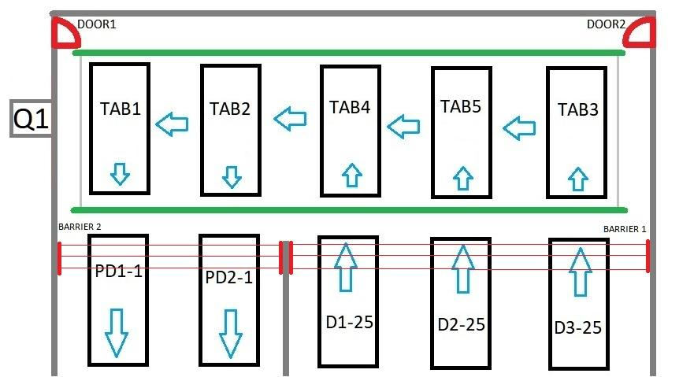
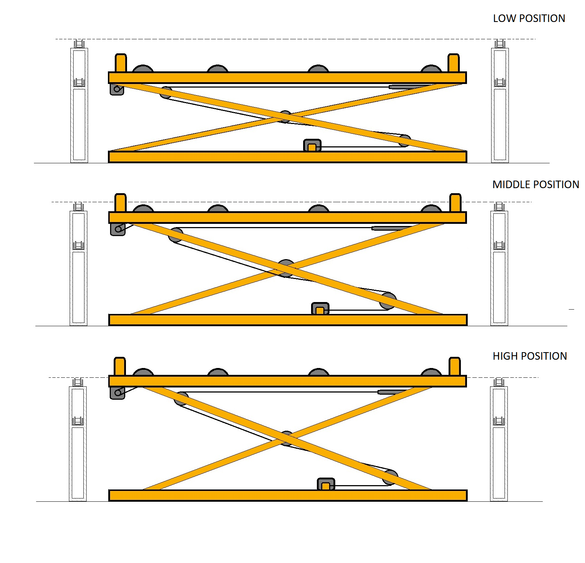
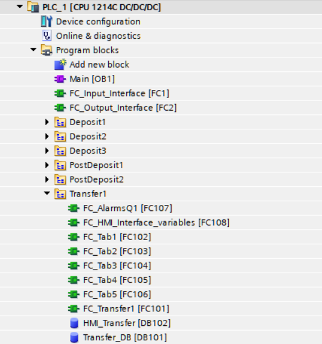
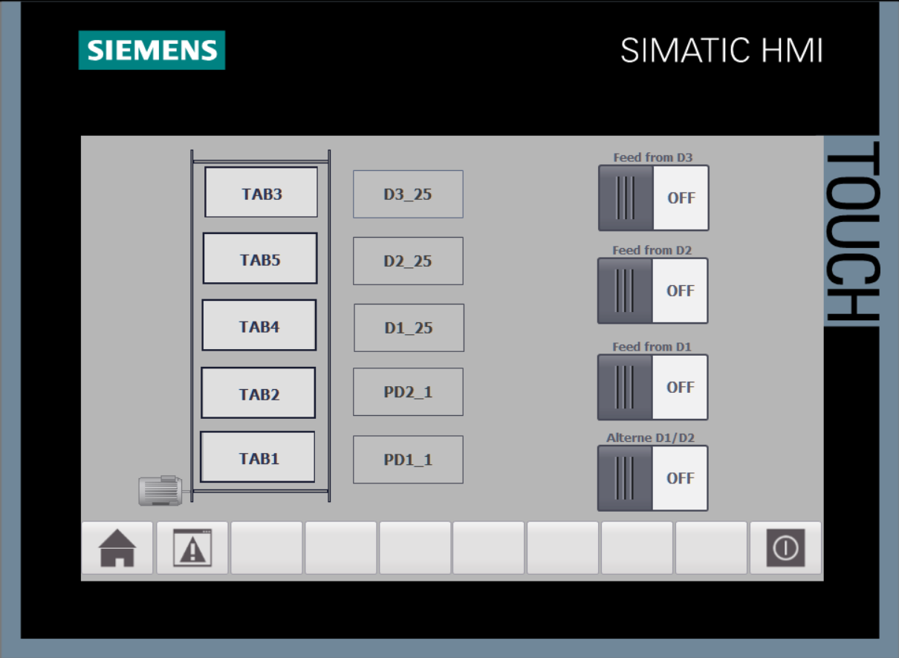

# Automotive Skid Transfer Station

PLC software for an automotive skid transfer station connecting storage and post-storage conveyor lines. Built as a learning project, inspired by a real transfer station on an automotive production line — not a copy of the original software or its control architecture.

## Overview

- Transfers car bodies mounted on skids between storage areas, using a chain conveyor and five lifting tables (TAB1–TAB5).
- Three input storage areas (D1, D2, D3) feed two output storage areas (PD1, PD2).
- D3 feeds only PD1. D1 and D2 both feed PD2 — the system alternates between them for balanced production flow, or pulls from whichever one has a car body if only one does.
- A photoelectric sensor on TAB2 detects longer-rear-section car bodies coming from D3 and routes them to PD1 correctly.

## Tech Stack

- **PLC:** Siemens S7-1200, CPU 1214C DC/DC/DC + digital expansion modules
- **Software:** TIA Portal V17 — Ladder (sequencing, actuator control) + SCL (data handling, interface logic)
- **HMI:** Siemens TP700 Comfort

## How It Works

Each lifting table has three positions:

| Position | Function |
|---|---|
| Upper | Feeding / waiting — no transverse movement, skid isn't in contact with the chain conveyor |
| Middle | Receiving a skid from the adjacent table (mechanical stoppers block pass-through) |
| Lower | Transferring a skid to the adjacent table |

**Sequence, in short:**
1. A free slot in PD1/PD2 triggers a `feeding` request from the matching deposit.
2. The table rises to its upper position with the skid.
3. If the next table is occupied → `waiting`. If not → `passingNext`.
4. In `passingNext`, the current table lowers while the next one rises to its middle position, and the chain conveyor transfers the skid across.
5. Repeats until `discharge` (TAB1/TAB2 only).

State distribution: **TAB5, TAB4, TAB3** run `feeding` / `waiting` / `passingNext`. **TAB1, TAB2** run `passingNext` / `waiting` / `discharge`.

## Software Architecture

One `Main [OB1]`, two I/O interface FCs (`FC_Input_Interface`, `FC_Output_Interface`), and one FC per functional group — five deposits/post-deposits plus a `Transfer1` group holding the per-table logic (`FC_Tab1`…`FC_Tab5`), the sequencing FC (`FC_Transfer1`), alarm handling (`FC_AlarmsQ1`), and the HMI interface FC.

## Alarms & Safety

- **"Freeze actuators" philosophy:** any error, alarm, or emergency freezes all actuators in place while sequence states are preserved — recovery resumes from the exact interrupted point rather than resetting the sequence, since multiple parallel, interdependent states make a full reset impractical.
- A safety relay monitors two safety doors and two safety light curtains; only when all are safe does it enable a safety output back to the PLC.

## Manual Mode & Manual Maintenance Mode

- **Manual mode:** only allows movements valid for the current sequence state (e.g., can't move a chain conveyor mid-`feeding`) — safe for any operator.
- **Manual maintenance mode:** bypasses those state checks entirely, for qualified personnel only. Key-switch selected. Still hard-limited by the safety relay.

## HMI

Overview screen with system layout, alarm management screen, and a dedicated screen per lifting table with manual controls, including the chain conveyor motor.

---

**Author:** A. Fernando Gola — 2026
